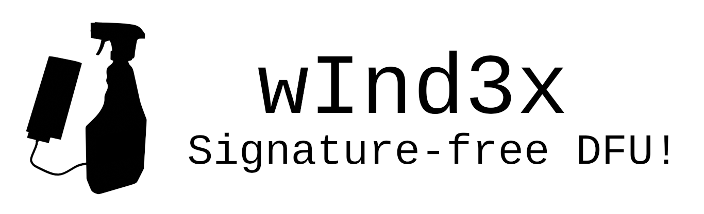

wInd3x
======

Clickwheel iPod bootrom/DFU exploit.

| Device       | Haxed DFU     | Decrypt/Dump | Notes                             |
|--------------|---------------|--------------|-----------------------------------|
| Nano 3G      | *not yet*     | **YES**      |                                   |
| Nano 4G      | **YES**       | **YES**      |                                   |
| Nano 5G      | **YES**       | **YES**      |                                   |
| Nano 6G      | never         | never        |                                   |
| Nano 7G      | never         | never        |                                   |
| Classic “6G” | *not yet*     | **YES**      | Experimental, same ROM as Nano 3G |
| iPod Touch   | never         | never        |                                   |

Building
--------

You'll need go, libusb, and [keystone](https://github.com/keystone-engine/keystone) (not the OpenStack keystone). Then:

    $ go build

Or, if you have Nix(OS), just do:

    $ nix-build

We're working on making this easier to build and providing pre-built binaries.

Running
-------

Put your iPod into DFU mode by connecting it over USB, holding down menu+select until it reboots, blanks the screen, then shows the Apple logo, then blanks the screen again. The iPod should enumerate as 'USB DFU Device'.

Then, run `wInd3x haxdfu` to put the iPod into 'haxed DFU' mode. This is a modified DFU mode that allows booting any DFU image, including unsigned and unencrypted ones. The mode is temporary, and will be active only until next (re)boot, the exploit does not modify the device permanently in any way.

    $ ./wInd3x haxdfu
    [...]
    2021/12/31 00:59:15 Haxed DFU running!

You can then use any DFU tool to upload any DFU image and the device should boot it. You can also use the `run` subcommand to wInd3x to make it immediately send a file as a DFU image after starting haxed DFU mode (if needed):

    $ ./wInd3x run wtf-test.dfu
    [...]
    2022/01/06 00:06:56 Uploading wtf-test.dfu...
    2022/01/06 00:06:56 Image sent.

Running iBugger / EmCORE / Rockbox
----------------------------------

Or, “what can I do with this”?

To be documented :)

Haxed DFU Mode
--------------

When in haxed DFU mode, the DFU will continue as previously, and you will still be able to send properly signed and encrypted images (like WTF). However, signature checking (in header and footer) is disabled. What this means:

 - Images with format '3' (like WTF) will not be sigchecked, but will be decrypted.
 - Images with format '4' will not be sigchecked and will not be decrypted.
 - Pwnage 2.0 images *might* work if they are built to be able to run without having to exploit footer signature checking.

To make your own DFU images, you should thus make format '4' images, not encrypt them and not sign them.

Building DFU Images
-------------------

If you have a flat binary file which expects to run from DFU mode and be loaded at address 0x22000000, you can use the `makedfu` command to wrap it in a Haxed DFU compatible DFU image.

    $ ./wInd3x makedfu flat.bin image.dfu -k n5g

If the entrypoint is not at the beginning of the file, an offset can be provided with `-e 0xf00`.

Dumping Memory
--------------

wInd3x also supports memory reads from a running bootrom. For example, to dump the bootrom's code to a file:

    $ ./wInd3x dump 0x20000000 0x10000 /tmp/bootrom.bin
    [...]
    2022/01/06 03:10:08 Dumping 20000000...
    2022/01/06 03:12:41 Dumping 2000ffc0...
    2022/01/06 03:12:41 Done!

This will take a few minutes. Ignore any 'libusb: interrupted' errors, these are just spurous debug logs from gousb.

Decrypting Images
-----------------

wInd3x can decrypt IMG1 files (eg. a WTF) using a locally-connected device. These decrypted and unsigned images can then be loaded  via Haxed DFU.

    $ ./wInd3x decrypt WTF.x1225.release.dfu wtf-dec.dfu
    2022/01/06 04:20:08 Parsed Nano 4G image.
    2022/01/06 04:20:08 Decrypting 1e800 bytes...
    2022/01/06 04:20:08 Decrypting first block...
    2022/01/06 04:20:08 Decrypting 0x40...
    [...]

This will take a few minutes. Ignore any 'libusb: interrupted' errors, these are just spurous debug logs from gousb.

If you decrypted a valid WTF image, you should be able to then run it:

    $ ./wInd3x run wtf-dec.dfu

Known issues
============

1. Decryption/dumping is slow, as every 0x30/0x40 we run the exploit again. We should find a better way to get code execution for this kind of tasks.
2. Things are sometimes unstable, especially when changing modes/payloads. We should probably flush icaches more aggressively.

Vulnerability
=============

This exploits a vulnerability in the standard SETUP packet parsing code of the bootrom, in which the wIndex parameter is not checked for bmRequest == {0x20, 0x40}, but is still used to index an array of interface/class handlers (that in the Bootrom has a length of 1).

Nano 4G and 5G Exploit Chain
--------------------

The first requirement is to find a suitable (blx r0) instruction in the bootrom code of the device. For Nano 4G the only one such instruction is at offset 0x3b0, and for Nano 5G there is such instruction at 0x37c. We'll refer to it as X below.

We abuse the fact that wIndex == 3 for bmRequest 0x40 treats a 'bytes left to sent over USB' counter as a function pointer and calls it with r0 == address of SETUP. We massage the DFU mode into attempting to send us X+0x40 bytes, and failing after 0x40 bytes, thereby leaving the counter at X bytes and executing code at address X.

Since the bootrom is mapped at offset 0x0 as well as 0x20000000 at boot, this means we execute bootrom code, and X happens to point to a 'blx r0' instruction. This in turn causes the CPU to interpret the SETUP packet received as ARM code, because the SETUP handler is called with the SETUP packet as its argument, i.e. r0.

We specially craft the SETUP packet to be a valid ARM branch instruction, pointing somewhere into a temporary DFU image buffer. By first sending a payload as a partial DFU image (aborting before causing a MANIFEST), we finally get up to be able to execute either 0x800 on Nano 4G or 0x400 on Nano 5G bytes of fully user controlled code.

In that payload, we send a stub which performs some runtime changes to the DFU's data structures to a) return a different product string b) overwrite an image verification vtable entry with a function that allows unsigned images. Some SRAM is carved out by this payload to store the modified vtable and custom verification function.

Nano 3G and Classic (”6G”)
--------------------------

With bRequestType == 0x20 and wIndex == 6 we directly jump to code execution at the SETUP packet.

This Bootroom does not have a VTable which can be easily hooked to override functions to provide Haxed DFU functionality. Another way needs to be found.

Nano 6G and 7G
--------------

The vulnerability does not appear to exist on these devices. Either it was fixed or the USB stack has replaced with a different codebase.

iPhone, iPod Touch
------------------

This vulnerability does not exist on non-clickwheel-iPods, as those use a different bootrom (SecureROM/iBoot) that has a different USB stack.

Support
=======

IRC: #freemyipod on libera.chat

License
=======

Copyright (C) 2022 Serge 'q3k' Bazanski (q3k@q3k.org)

This program is free software; you can redistribute it and/or modify
it under the terms of the GNU General Public License as published by
the Free Software Foundation; either version 2 of the License, or
(at your option) any later version.

This program is distributed in the hope that it will be useful,
but WITHOUT ANY WARRANTY; without even the implied warranty of
MERCHANTABILITY or FITNESS FOR A PARTICULAR PURPOSE.  See the
GNU General Public License for more details.

You should have received a copy of the GNU General Public License along
with this program; if not, write to the Free Software Foundation, Inc.,
51 Franklin Street, Fifth Floor, Boston, MA 02110-1301 USA.
